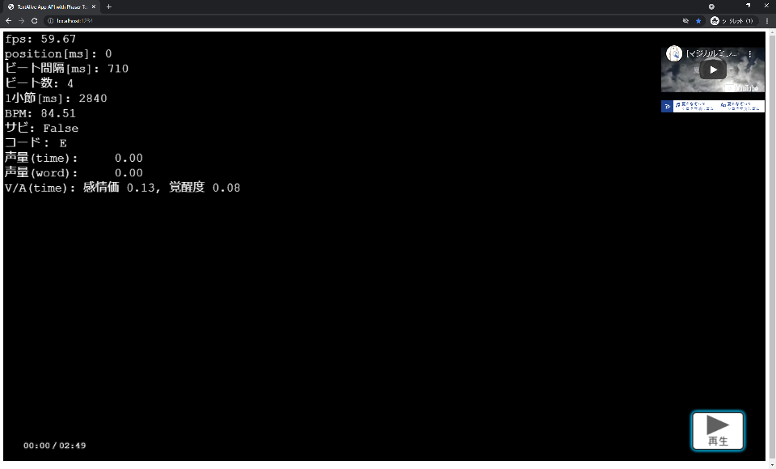

# 概要
本プログラムは textalive-app-api (ver.0.3.0) において以下の挙動に関する問い合わせのための検証用に作成したものです。
- Player.requestPlay() 実行後、PlayerEventListener.onTimeUpdate() が呼ばれるタイミングまでにPlayer.timer.position を参照すると曲の長さを超える値が入ってる
- 歌詞情報のないタイミングで Player.data.getVocalAmplitude() にて声量を取得しても値が常に 0 を超えている
- Player.video.lastChar.endTime を超える値で Player.getValenceArousal() を実行するとエラーが発生する場合がある
- 頻繁にビート間隔が変動している


# 問い合わせ内容
## Player.requestPlay() 実行後、PlayerEventListener.onTimeUpdate() が呼ばれるタイミングまでに Player.timer.position を参照すると曲の長さを超える値が入ってる
### 症状
Player.requestPlay() 実行後、PlayerEventListener.onTimeUpdate() が呼ばれるタイミングまでに</br>
Player.timer.position を参照すると曲の長さを超える値が入っています。</br>
この現象はプログラムから Player.requestPlay() を実行せずとも Player クラスが生成する Youtube プレイヤーにて再生した場合でも発生します。</br>
この現象はアプリ起動直後、初回の再生時には発生せず、一度楽曲を再生し一時停止した後に再生すると発生します。</br>

### 再現方法
アプリを起動し、画面右下の再生/一時停止ボタンで楽曲を再生、一時停止を切り替え再生直後に</br>
コンソール出力で曲の長さを超える値が入ってるメッセージが出力されていることをを確認する。</br>
表示処理は object/TimeInfoObject.ts にて実装しています。</br>

### 原因の推測
本プログラムは Phaser というフレームワークを使用しています。</br>
- Phaser公式 https://phaser.io/phaser3</br>
- npm phaser https://www.npmjs.com/package/phaser</br>

アプリで表示している各種オブジェクト (Paser.GameObjects.Text, Image など) の</br>
init(), preload(), create(), update() 関数の呼び出しは Phaser が管理しており、</br>
その中でも毎フレーム update() 内で Player.requestPlay() を実行すると</br>
Playerに登録したイベントハンドラが呼び出される前に再度 update() が実行され</br>
Player が requestPlay() を処理している最中にアクセスしてしまったのが不具合の原因だと推測しています。</br>

### 現状での回避方法
本プログラムでは、この状況の回避方法として Player のラッパー (TextaliveApiManager) を用意しイベントハンドラで値を取得、</br>
アプリ側はこのラッパーが保持している値を用いる事で対応しています。</br>

### 要望
App API 側で常に問題のない値が取得できるようダブルバッファリングなどの対応を行って頂けると助かるのですが対応は可能でしょうか？</br>
</br>
本件、Phaser に限らず TextAlive App API と非同期で更新処理を実行・管理するフレームワークを使用すると発生するのではないかと考えており</br>
この推測が正しければ、ぜひ対応を入れて頂きたいと思っております。</br>


## 歌詞情報のないタイミングで Player.data.getVocalAmplitude() にて声量を取得しても値が常に 0 を超えている
### 症状
const word = Player.video.findWord(Player.timer.position); (word == null) を満たす状態で</br>
Player.data.getVocalAmplitude(Player.timer.position) にて声量を取得しても値が常に 0 を超えています。</br>
</br>
数秒以上ボーカルのない間奏のタイミングでも声量が 0 になりませんが、これは意図されている挙動でしょうか？</br>

### 再現方法
ボーカルのない間奏のタイミングで画面左上の「声量(time): ****」の値が 0 になっていないことを確認する。</br>
表示処理は object/DebugInfo.ts にて実装しています。</br>

### 現状での回避方法
Player.video.findWord(Player.timer.position) にて歌詞情報があるかチェックし、なければ声量を 0 として扱う。

### 要望
歌詞に登録されていないコーラスやハミング等が存在する可能性はある為、歌詞情報がなければ声量が常に 0 になるとは思っておりませんが</br>
可能であれば確実にボーカル要素の無いタイミングでは声量が 0 となるよう対応頂けますと助かります。</br>


## Player.video.lastChar.endTime を超える値で Player.getValenceArousal() を実行するとエラーが発生する場合がある
### 症状
Player.video.lastChar.endTime + OFFSET < position (OFFSETは数秒程度を表す値) を満たす状態で</br>
Player.getValenceArousal(position); を実行すると以下のエラーが発生しました。</br>

```
Uncaught TypeError: Cannot read properties of undefined (reading 't')
    at t.getValenceArousal (index.es.js:2)
    at t.getValenceArousal (index.es.js:2)
    at t.getValenceArousal (index.es.js:2)
    at Player.getValenceArousal(position) を呼び出した関数
    at ...
```

このエラーが発生すると Player の値を参照し表示しているものが更新されなくなってしまいます。</br>

### 再現方法
楽曲を再生し最後の歌詞が終わった後、コンソール出力を確認する。</br>
表示処理は object/DebugInfo.ts にて実装しています。</br>
このエラーが発生すると Player の値を参照し表示しているものが更新されなくなってしまう為、try-catch にてエラーを無視し警告扱いとしてコンソール出力しています。</br>

### 現状での回避方法
try-catch にてエラーを無視する。</br>

### 要望
不具合の原因をご指摘や、このような現象が発生した場合にどの処理に関わる個所から不具合調査を進めると良いか助言を頂けますと助かります。</br>


## 頻繁にビート間隔が変動している
### 症状
ほぼ1ビート毎にビート間隔 (IBeat.duration) が変わっており、BPMの表示やBPMに即した演出を実装しようとするとそれらの表示が安定しなくなります。</br>

### 再現方法
画面左上の「ビート間隔[ms]: ****」の値が頻繁に変わっていることを確認する。</br>
表示処理は object/DebugInfo.ts にて実装しています。</br>

### 現状での回避方法
良いな回避方法が見つからず。</br>
現在のビートから数ビート先までの情報を取得し平均をとると以下の問題が残ってしまう。</br>
- 曲中でBPMが変動するケースに対応できない
- 平均をとる際の妥当なビート数をいくつとするのが良いか確定できない
- 適切な平均が取れたとして、正しいビート間隔に近似されるかもしれないが誤差は発生する可能性がある

### 要望
楽曲のBPM推定、テンポ推定は難しい技術課題であると認識しておりますが、</br>
Aメロ、Bメロ、サビなどの単位で値が安定しているとアプリ側で扱いやすいので</br>
改善いただけると助かります。（楽曲のコンセプトで意図してリズム難になっているものを除く）</br>


# 検証用プログラム
## 起動方法
node.js をインストールし、npm が使用可能な環境で</br>
package.json があるディレクトリ (app) にて以下のコマンドを実行して下さい。</br> 
### パッケージインストール
> npm install
### アプリの起動
> npm run dev

http://localhost:1234/ にアクセス。</br>


## プログラムの動作イメージ



## プログラムの構成
ソースコードは app/src 以下にあります。各ソースコードの概要は以下の通りです。</br>

### index.ts
エントリーポイント用</br>

### MusicInfo.ts
マジカルミライ2021プログラミングコンテスト対象楽曲の Plyaer.createFromSongUrl() 用パラメータ定義</br>

### TestScene.ts
アプリの表示物および TextaliveApiManager を生成、動作を管理するクラス。</br>
再生する楽曲を変更する場合は TestScene.init() を確認して下さい。</br>
Playerのロード完了後 Player.requestPlay() を実行しています。</br>

### TextaliveApiManager.ts
Player クラスを保持、イベントハンドラの登録を行っているクラス。</br>

### object/DebugInfo.ts
アプリの画面左上に Player から取得した情報を表示しているクラス。</br>
</br>
以下の問い合わせ内容の検証コードはこのファイル内 DebugInfo.makeSongInfo() を確認して下さい。</br>
「Player.data.getVocalAmplitude() にて取得した声量の値が常に0を超えている」</br>
「Player.video.lastChar.endTime を超える値で Player.getValenceArousal() を実行するとエラーが発生する場合がある」</br>
「頻繁にビート間隔が変動している」</br>

### object/TimeInfoObject.ts
アプリの画面左下に現時点の曲の再生時間および曲の長さを表示しているクラス。</br>
毎フレーム Player.timer.position を参照しています。</br>
</br>
以下の問い合わせ内容の検証コードはこのファイル内 TimeInfoObject.updateText() を確認して下さい。</br>
「Player.requestPlay() 実行後、PlayerEventListener.onTimeUpdate() が呼ばれるタイミングまでにPlayer.timer.position を参照すると曲の長さを超える値が入ってる」</br>

### object/ImageButtonObject.ts
PauseButtonObjectを実装するためのクラス。</br>

### object/PauseButtonObject.ts
アプリの画面右下に曲の再生、一時停止を行うボタンを実装するためのクラス。</br>
ボタンが押された際、状況に応じて Player.requestPlay(), Player.requestPause() を実行しています。</br>


## 使用パッケージのライセンス
- @types/node</br>
Copyrights are respective of each contributor listed at the beginning of each definition file.</br>
https://github.com/DefinitelyTyped/DefinitelyTyped/blob/master/LICENSE</br>

- phaser</br>
Copyright © 2021 Richard Davey, Photon Storm Ltd.</br>
https://phaser.io/download/license</br>

- textalive-app-api</br>
© AIST TextAlive Project 2020</br>
https://github.com/TextAliveJp/textalive-app-api/blob/master/LICENSE.md</br>

- ts-node</br>
Copyright (c) 2014 Blake Embrey (hello@blakeembrey.com)</br>
https://github.com/TypeStrong/ts-node/blob/main/LICENSE</br>

- del-cli</br>
Copyright (c) Sindre Sorhus <sindresorhus@gmail.com> (https://sindresorhus.com)</br>
https://github.com/sindresorhus/del-cli/blob/main/license</br>

- parcel-buncler</br>
Copyright (c) 2017-present Devon Govett</br>
https://github.com/parcel-bundler/parcel/blob/v2/LICENSE</br>

- typescript</br>
本アプリではApach License 2.0 のライセンスで配布されているパッケージがインストールされます</br>
Apache License 2.0 http://www.apache.org/licenses/LICENSE-2.0</br>
https://github.com/microsoft/TypeScript/blob/main/LICENSE.txt</br>
